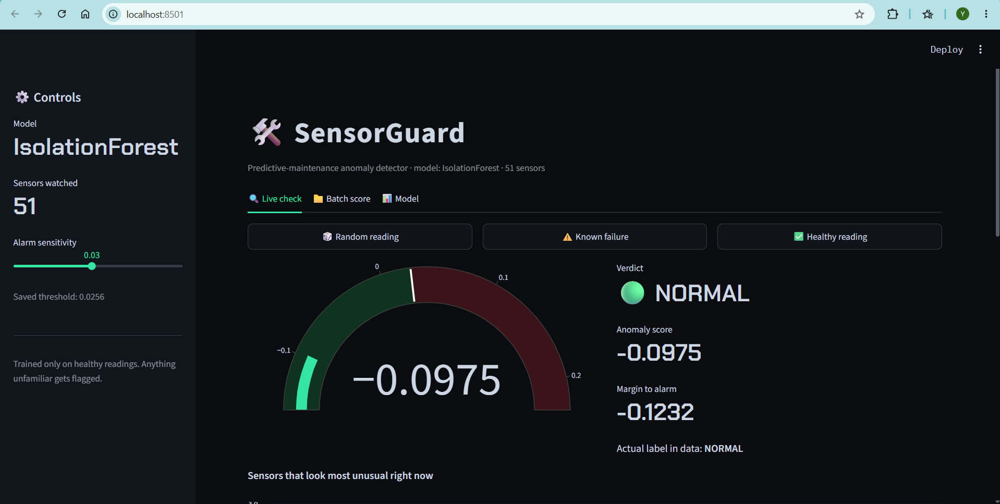
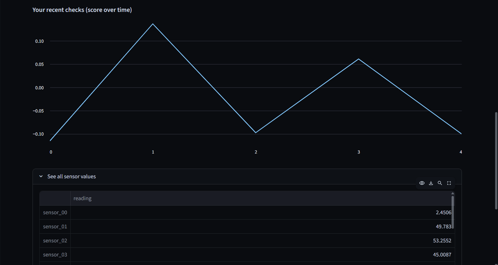

# SensorGuard


Predictive-maintenance anomaly detection for industrial pump sensors. SensorGuard learns what a healthy pump looks like, flags readings that drift away from normal, and serves it all through a Streamlit dashboard.


## What it does

Pumps fail. The costly part is rarely the repair, it is the surprise. SensorGuard watches 51 sensor channels and raises a flag the moment the readings stop looking normal, early enough to do something about it.

The key point: it is trained only on healthy readings. It never needs a pile of labeled failures to be useful, which matches how real plants actually run. You have years of "the pump is fine" and almost no labeled breakdowns.

## The decision behind the model

I benchmarked eight models on the same data, and the result is worth pausing on.

| Model | Type | F1 | Recall |
|---|---|---|---|
| Random Forest | supervised | 1.000 | 1.000 |
| HistGradientBoosting | supervised | 1.000 | 1.000 |
| KNN | supervised | 0.997 | 0.997 |
| Decision Tree | supervised | 0.989 | 0.999 |
| Logistic Regression | supervised | 0.975 | 0.999 |
| **Isolation Forest** (shipped) | unsupervised | **0.681** | **0.994** |
| Elliptic Envelope | unsupervised | 0.673 | 1.000 |
| Local Outlier Factor | unsupervised | 0.576 | 0.844 |

The supervised models score almost perfectly. That is not a win, it is a warning. A perfect score on failure detection usually means the question was too easy, and here it is: those models are just recognizing a machine that is already in recovery, which is obvious from the sensors. That is reading the present, not predicting the future.

So SensorGuard ships the honest model instead. Isolation Forest never sees a single failure label during training. It catches about 99% of failures (0.99 recall) at 0.68 F1 and scores all 220,000 readings in under 2 seconds. The false-alarm rate is real and visible, and the dashboard lets you tune it.

## Dataset

Kaggle [pump sensor data](https://www.kaggle.com/datasets/nphantawee/pump-sensor-data): about 220,000 minute-by-minute readings across 52 sensors, labeled NORMAL, RECOVERING, or BROKEN.

The CSV is large, so it is not committed to this repo. Download it from the link above and drop `sensor.csv` into the `data/` folder. The labels are used only to score the model, never to train it.

## Project structure

```
sensorguard/
├── docs/
│   └── screenshot_1.png
    └── screenshot_2.png
├── data/
│   └── sensor.csv          # download from Kaggle (not in repo)
├── model/
│   └── sensorguard.joblib  # saved model, scaler, and threshold
├── src/
│   ├── train.ipynb         # cleans data, benchmarks models, saves the winner
│   └── app.py              # the Streamlit dashboard
├── requirements.txt
└── README.md
```

## Run it yourself

```bash
# 1. clone and enter
git clone https://github.com/yashicode/sensorguard.git
cd sensorguard

# 2. set up an environment (conda shown; venv works too)
conda create -n sensorguard python=3.11
conda activate sensorguard
pip install -r requirements.txt

# 3. add the data
# download sensor.csv from Kaggle and place it in data/

# 4. train the model (creates model/sensorguard.joblib)
#    open src/train.ipynb and run all cells

# 5. launch the dashboard
python -m streamlit run src/app.py
```

The dashboard opens at `http://localhost:8501`.

## What the dashboard shows

A gauge for the live anomaly score with the alarm threshold marked on it. Three readouts for the verdict, the score, and how far it sits from the alarm line. A short chart of the sensors that look most unusual for the current reading, so it explains itself instead of just saying yes or no. A batch tab that scores an uploaded CSV and hands back the results. And a sensitivity slider, which is the part to play with: drag it and watch the precision and recall trade off in real time.

## Honest limitations

- Precision sits around 0.52, so roughly half the alerts are false alarms at the default threshold. In a plant you would tune the threshold to whatever false-alarm rate operators can live with.
- The model reacts to abnormal readings rather than forecasting a failure hours ahead. True early-warning would need a time-window target and many more labeled failure events than the seven this dataset contains.
- Each prediction looks at a single moment. Rolling-window features (a sensor's recent average, its rate of change) would likely help and are the natural next step.

## License

MIT. See [LICENSE](LICENSE).
